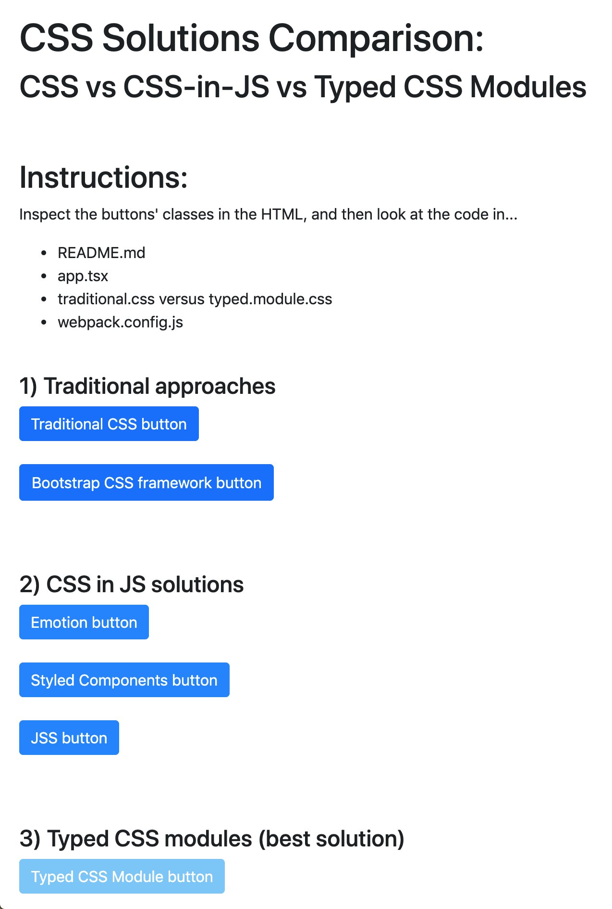
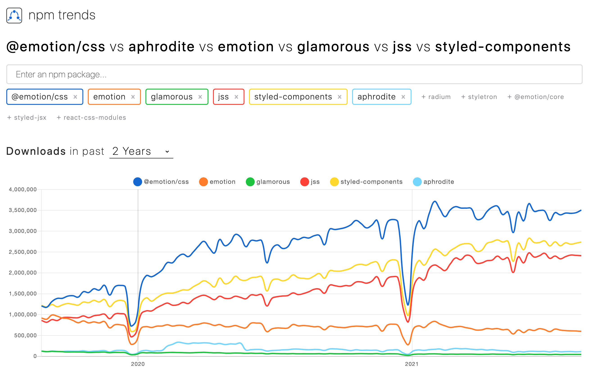

# CSS Solutions Comparison: CSS vs CSS-in-JS vs Typed CSS Modules

Demo of typed CSS modules versus traditional/untyped CSS. Search for "NOTE" in this project for details on how it works.

## Prerequisites
- Node v12+

## Setup
- `npm install`

## Run
- `npm start`
- Open `http://localhost:3000/` in your browser

## Best Solution
- Perhaps the best solution is to use a mix of all three where appropriate
  - Traditional CSS for global styling (e.g. body tag, fonts throughout all pages)
  - CSS framework like Bootstrap to save you lots of time from creating your own
  - CSS-in-JS if you are creating your own CSS framework
  - Typed CSS modules when writing CSS you don't want to conflict. (Best solution most of the time.)

## More Information
- Create React App automatically supports CSS Modules  
  https://create-react-app.dev/docs/adding-a-css-modules-stylesheet/
- Comparison of CSS in JS solutions' popularity  
  https://www.npmtrends.com/@emotion/css-vs-emotion-vs-glamorous-vs-jss-vs-styled-components-vs-aphrodite

## Credits
- Original code generated from [createapp.dev](https://createapp.dev/)

---

---

