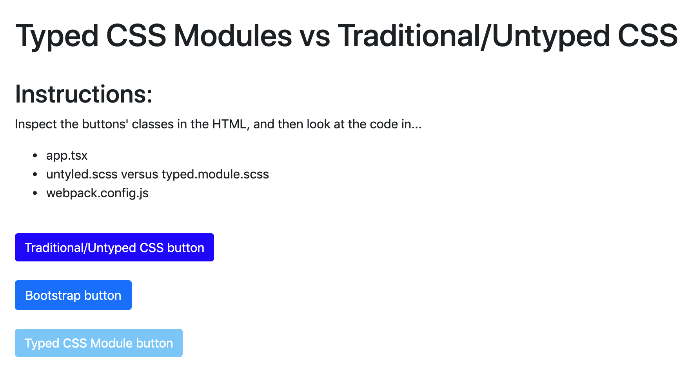

# Typed CSS Modules vs Traditional/Untyped CSS

Demo of typed CSS modules versus traditional/untyped CSS. Search for "NOTE" in this project for details on how it works.

## Prerequisites
- Node v12+

## Setup
- `npm install`

## Run
- `npm start`
- Open `http://localhost:3000/` in your browser

## Credits
- Original code generated from [createapp.dev](https://createapp.dev/)

---

